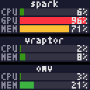

# mon64

Prometheus endpoint aggregator that normalizes remote server metrics into a web dashboard, JSON/YAML API, and compact PNG badges.



## Build

```bash
go build -o bin/mon64 ./cmd/mon64
```

## Run

```bash
./bin/mon64 -config configs/example.yaml
```

Use dummy mode to preview the dashboard without Prometheus endpoints:

```bash
./bin/mon64 -config configs/example.yaml -dummy
```

In dummy mode, each node only needs `name` and `collects`; requested metrics
receive fixed sample values and no remote requests are made.

To mirror the stacked badge to a Pixoo64 on the same LAN:

```bash
./bin/mon64 -config configs/example.yaml -export pixoo64
```

The Pixoo64 is discovered automatically. The display is refreshed after
snapshot changes; stacks taller than 64 pixels are scaled to fit the 64×64
display.

## Configuration

See `configs/example.yaml`. Key fields:

| Field | Description |
|-------|-------------|
| `listen` | HTTP listen address (e.g. `:8080`) |
| `scrape_interval` | Time between collection rounds |
| `scrape_timeout` | Per-endpoint HTTP timeout |
| `nodes[].prom_fmt` | `node-exporter` or `nv-monitor` |
| `nodes[].prom_api_key` | Optional bearer token; when set, sends `Authorization: Bearer {key}` |
| `nodes[].collects` | Subset of `cpu`, `gpu`, `mem`, `swap` |

## HTTP endpoints

| Path | Description |
|------|-------------|
| `GET /` | Dashboard (all nodes) |
| `GET /api/v1/nodes` | Canonical JSON snapshot |
| `GET /api/v1/nodes.yaml` | YAML snapshot |
| `GET /api/v1/badge` | All 64px-wide node badges stacked with 1px separators |
| `GET /api/v1/badge/{node}.png` | One 64px-wide node badge |
| `GET /healthz` | Liveness probe |
| `GET /metrics` | mon64 self-metrics (Prometheus text) |

API responses use the in-memory snapshot from the last scheduled scrape, not live remote calls.

## Metric mapping

### node-exporter

- **CPU**: delta of `node_cpu_seconds_total` between scrapes; `100 * (1 - idle_delta / total_delta)`. Unavailable on first scrape.
- **Memory used**: `(MemTotal - MemAvailable) / MemTotal * 100`
- **Memory cached**: `Cached / MemTotal * 100`
- **Swap used**: `(SwapTotal - SwapFree) / SwapTotal * 100`; unavailable when `SwapTotal == 0`

### nv-monitor

- **CPU**: `nv_cpu_usage_percent{cpu="overall"}`
- **GPU**: arithmetic mean of all `nv_gpu_utilization_percent` series (multi-GPU policy)
- **Memory**: `used/total`, `bufcache/total` from `nv_memory_*_bytes`
- **Swap**: `nv_swap_used_bytes / nv_swap_total_bytes * 100`

Unset or uncollectable fields are omitted (null), never coerced to zero.

## Badge font

Badges use **[Tom Thumb](https://robey.lag.net/2010/01/23/tiny-monospace-font.html)** (4×6 monospace by Robey Pointer), from `ref/tom-thumb.bdf`. The same file is embedded in `internal/exporter`; the dashboard uses pixel-perfect CSS scaling for legibility.

## Docker

```bash
docker build -t mon64 .
docker run --rm -p 8080:8080 -v $(pwd)/configs/example.yaml:/config.yaml mon64 -config /config.yaml
```

## Production features

- **Structured logging**: JSON logs via `log/slog`
- **Request logging**: Gin middleware logs method, route, status, duration
- **Config hot-reload**: `fsnotify` watches the config file; `SIGHUP` also triggers reload. `listen` changes require restart.
- **Self-metrics**: `GET /metrics` exposes scrape and HTTP counters

## Development

```bash
go test ./...
go vet ./...
gofmt -w .
```

Fixtures for tests live in `ref/`.
